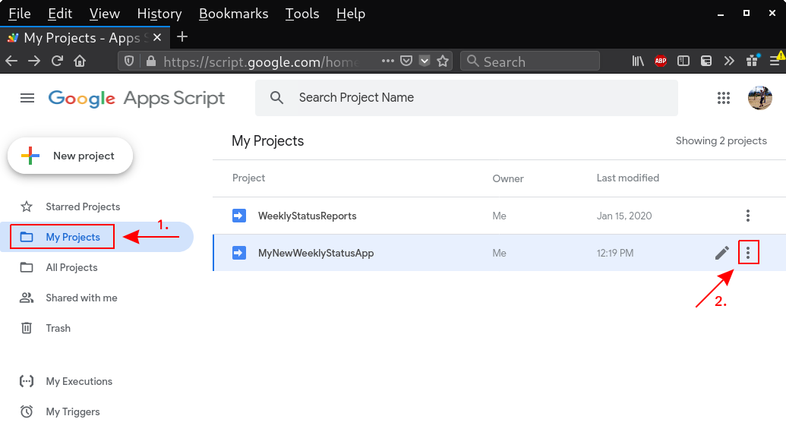
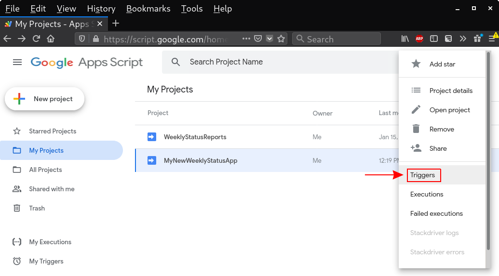
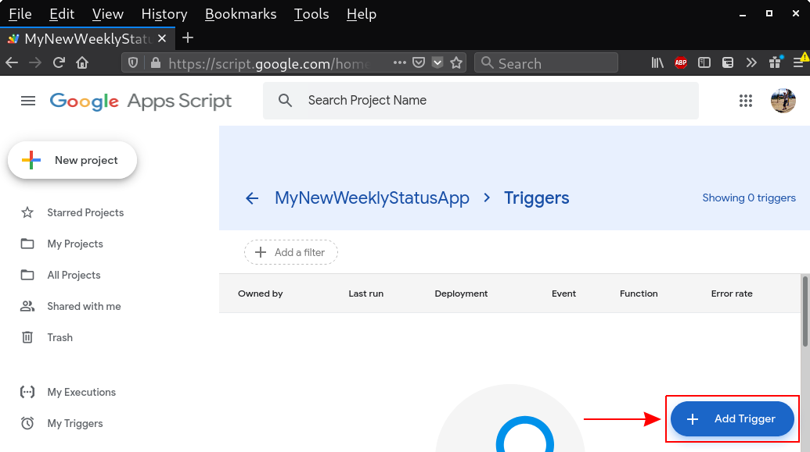
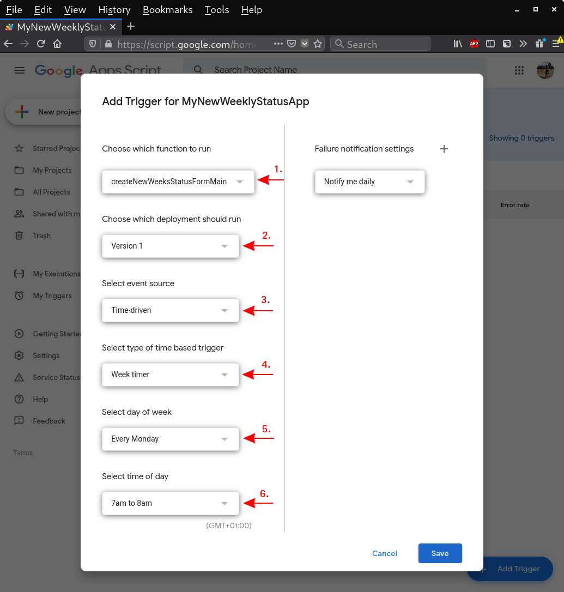

# Automated gathering of weekly status using Google Form
This is a simple Google-Apps-Scrip application automating gathering of weekly status report from team members. It can re-create the submission form for the current week (it changes the week number), notify people via email to submit their status and also remind people who didn't provide their status by the deadline, to do so ASAP.

The application always uses the same Google Form and Spreadsheet. These must be provided to the application, as they are not created automatically.

**Pull-requests with enhancements and bug fixes are welcomed.**

## Main application functions

### `createNewWeeksStatusFormMain()`
This function re-created the submission form (specified by **STATUS_FORM_URL**) for the current week. It also creates new sheet in the spreadsheet (specified by **STATUS_SPREADSHEET_URL**) for the current week and renames it to "*\<week_number\>*-*\<year\>*". If the spreadsheet already contains sheet with such name, the original sheet is renamed by appending " (backup at *\<timestamp\>*)" to its name. After this function is called, it will no longer be possible to submit the status for previous week.

### `notifyWeekStatusViaEmailMain()`
Notifies all email addresses listed in **TEAM_EMAILS**, which didn't submit a response using the form for the current week, to provide the status using the form URL. The deadline in the email is currently hard-coded to Thursday midnight. If you need to change the deadline to a different day, modify the code or submit a pull-request to enable configuration of the deadline.

### `remindWeekStatusViaEmailMain()`
Reminds all email addresses listed in **TEAM_EMAILS**, which didn't submit a response using the form for the current week, that the deadline passed and asking them to provide status ASAP.

## Schedule considerations
I encourage you to discuss the application triggers schedule with your team. This includes time when the form is regenerated for new week and when to send them email notifications and reminders.

My use case is that I have to process weekly team status around Friday noon. To achieve this, I use the following schedule for triggers:
- Regenerate the form by calling `createNewWeeksStatusFormMain()` every Monday between 7 and 8 AM.
  - I do not notify people for the new week right away.
  - I want to enable people to submit their status in advance, mainly for cases when they may have vacation starting in the middle of the week. Since the form URL is not changing, they can do it on any day since the beginning of the week.
- Notify people to submit their status by calling `notifyWeekStatusViaEmailMain()` every Thursday between 7 and 8 AM.
  - The email contains URL to the submission form.
  - The notification is sent on purpose close to the deadline, because otherwise there would be high possibility that people would forget about the status if the notification would be sent on Monday.
  - Deadline in the email is the same day (Thursday) midnight, to allow me to process the status on Friday morning.
- Remind people who didn't provide their status yet to do it ASAP by calling `remindWeekStatusViaEmailMain()` every Friday between 7 and 8 AM.
  - This still gives me some room to process the late status submissions.

## Application configuration
Global application configuration is contained inside `scriptDataObject` object.

Example configuration object: 

    var scriptDataObject = {
      'STATUS_SPREADSHEET_URL': '<URL>',
      'STATUS_FORM_URL': '<URL>',
      'TEAM_EMAILS': ['member1@example.com', 'member2@example.com'],

      'TEST_STATUS_SPREADSHEET_URL': '<URL>',
      'TEST_STATUS_FORM_URL': '<URL>',
      'TEST_TEAM_EMAILS': ['test@example.com'],

      'FORM_TITLE': Utilities.formatString('Status for week #%s-%s', getWeekNumber_(), new Date().getYear()),
      'FORM_DESCRIPTION': 'Please provide status report for the current week. Include any links to pull requests ' +
                     '/ bugs / documents / blogs / etc., that may be relevant. Keep it short and focus on things ' +
                     'that could be important for other teams to know about.',

      'FORM_SECTIONS': {
        'TIME_SPENT_SECTION': {
          'TITLE': 'Time spent this week',
          'HELP_TEXT': 'Please estimate how much of your work time did you spend this week on the contribution ' +
                     'areas listed below. Exclude any days off or holidays when calculating percent.\n\n' + 
                     'Try to map as much of your work as possible to our products. This means that if you ' +
                     'did some work in upstream, but it originated as a request from a customer in RHEL, then ' +
                     'mark it as such. A similar approach should be taken for the time spent on learning new ' +
                     'things and technologies. Use the Upstream-Community contribution area for pure proactive ' +
                     'work in upstream or Fedora.\n\n' +
                     'SUM OF ALL PERCENTS MUST BE EXACTLY 100%!!!',
          'REQUIRED': true, // OPTIONAL
          'CONTRIBUTION_AREAS': [
            'Security Issues',
            'Unplanned Customer Work',
            'Upstream-Community',
            'Next Product Release',
            'Project X'
          ]
        },

        'TEXT_SECTIONS': [
          {
            'TITLE': 'Progress this week',
            'HELP_TEXT': '• Please note (1-5) most important things that you worked on this week and what was the result.\n' +
                         '• If possible, please include also links (This is so that also other people and teams can check it).',
            'REQUIRED': true,   // OPTIONAL
            'VALIDATION': getParagraphValidatorMinChars_(10)    // OPTIONAL
          },
          {
            'TITLE': 'Higlights for this week',
            'HELP_TEXT': '• Please note anything that you are proud of and should be shared with other teams ' +
                           '(e.g. a new feature that you implemented in a project you work on; blog post that you\'ve written; ' +
                           'talk on a conference, ...)',
            'REQUIRED': false,
            'VALIDATION': getParagraphValidatorMinChars_(10)
          },
          {
            'TITLE': 'Plan for next 1-2 week',
            'HELP_TEXT': '• Please note (1-3) the most important things that you plan to work on in the next 1-2 weeks.',
            'REQUIRED': true,
            'VALIDATION': getParagraphValidatorMinChars_(10)
          },
          {
            'TITLE': 'Problems / Blockers / Management escalation',
            'HELP_TEXT': '• Please share anything blocking you from proceeding with your duties, which you can not easily ' +
                         'solve (e.g. you need a special hardware for implementing new feature in some project; unresponsive ' +
                         'team/engineer blocking your work; issue with some workflow, ...)\n' +
                         '• Feel free to note anything that you would like to escalate through the management chain.',
            'REQUIRED': false,
            'VALIDATION': getParagraphValidatorMinChars_(10)
          }
        ]
      }
    };

## How to deploy the application

1. Install [`clasp`](https://github.com/google/clasp).
1. Clone the this repository and enter the directory with the code.
1. Create new google-apps-script project using `clasp`

        clasp create --type standalone --title MyNewWeeklyStatusApp

1. Create new Google Spreadsheet and Google Form, to be used with the application.
1. Create data for the application.

        cp projectDataExample.js projectData.js

1. Modify application data for your own use case. Make sure to change:
    - **STATUS_SPREADSHEET_URL** - Use the URL of the spreadsheet, that you've created in the previous step.
    - **STATUS_FORM_URL** - Use the URL of the form, that you've created in the previous step.
    - **TEAM_EMAILS** - Provide a list of email addresses, where the request for status report should be sent.
    - **CONTRIBUTION_AREAS** under **FORM_SECTIONS**->**TIME_SPENT_SECTION** - Provide list of areas where you want to track spent time.
    - Feel free to modify any title or description text of form sections.

1. Push the script to Google.

        clasp push

    - The `clasp` tool will inform you, that the manifest file has been updated and ask you whether you want to push and overwrite it. Answer **Yes**.

1. Create a version of the application and deploy it. This will automatically create an immutable version of the application, which you can later use in time-based triggers.

        clasp deploy

1. Create time-based triggers

    1. Go to https://script.google.com. Under your projects **(1.)**, find the new one that you've created using `clasp` and click on "three dots" **(2.)**.

        

    1. Open **Triggers** for your project.

        

    1. Add new triggers for application functions that you want to use.

        

    1. Configure the new trigger based on you preferences.
        1. Choose the application function, which should be called by the trigger. This should be one of the following:
            - `createNewWeeksStatusFormMain()` - Re-creates the Form for current week and creates new sheet in the spreadsheet for the current week.
            - `notifyWeekStatusViaEmailMain()` - Notifies all email addresses listed in **TEAM_EMAILS**, which didn't submit a response using the form for the current week, to provide the status using the form URL. The deadline in the email is currently set to Thursday midnight. This is hardcoded in the code, therefore if you need to set the deadline to a different day, modify the code or submit a pull-request.
            - `remindWeekStatusViaEmailMain()` - Reminds all email addresses listed in **TEAM_EMAILS**, which didn't submit a response using the form for the current week, that the deadline passed and asking them to provide status ASAP.

        1. Choose the deployed application version, which you want to use. Note that if you deploy new version of the application, you must also modify the trigger if you want it to use the new application version.
        1. Choose **Time-driven** type of trigger.
        1. Choose **Week timer** if you want to gather weekly status. You may use other type of time-based trigger if you want to gather status e.g. monthly.
        1. Select the day of week, when the specified application function should be run.
        1. Select the time of day, when the specified application function should be run.

        

1. Enjoy weekly status being collected from your team to a Google Spreadsheet

